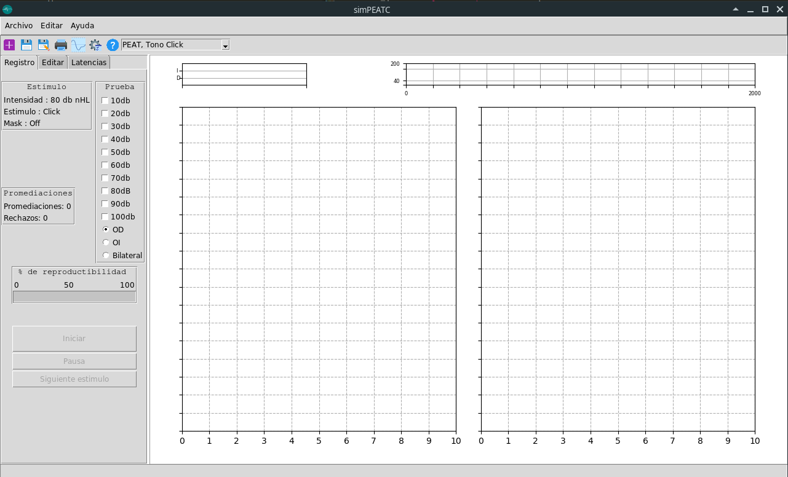

<h1 align="center">


<br/>
</h1>

<div align="center">

[](http://www.pmontt.uach.cl/)
[](http://tmedicapm.uach.cl/)
[](LICENSE.md)
[](https://twitter.com/intent/tweet?hashtags=imagesharp,dotnet,oss&text=simPEATC.Un+simulador+de+potenciales+evocados+auditivos+de+tronco+cerebral+en+Python+https://github.com/debaq/simPEATC+#simPEATC+#simulador+#UACH+#TM-PM)


</div>


### simPEATC, Simulador de Potenciales Evocados de Tronco Cerebral.

simPEATC, es un proyecto de simulador de PEATC, para estudiantes de electrofisiología auditiva


### Estado actual del proyecto

* **[:ok:]Pantalla Inicial**
* **[:speak_no_evil:]Insertar Matplotlib seteado**
* **[:construction_worker:]i18n**
* **[:rat:]Configuración de tonos**
* **[:rat:]Desarrollo del Hadware**


:ok::OK, :speak_no_evil::50/50, :construction_worker::en construcción, :rat:: nivel rata(no funciona, ¡aún!)

### Imágenes 
_Pantalla inicial:_


#### Pre-requisitos
_Para correr este script de Python es necesario tener instalado:_

```
Python 3.x
Matplotplib 
Tkinter
PIL
Numpy
csv
```


### Construido con 🛠️

_Este proyecto se ha desarrollado con las siguientes herramenientas_

* [Python](https://www.python.org/) 
* [Tkinter](https://docs.python.org/2/library/tkinter.html) 
* [Matplotlib](https://matplotlib.org/) 


### Autores ✒️

_Este sofware a sido construido por:_

* **David Ávila Quezada** - *Trabajo Inicial* - [Davila](http://tmedicapm.uach.cl/docentes/david-%C3%A1vila-quezada)
* **Maria Paz Latorre Gonzalez** - *Casos* - 
* **Ignacia Inarejo Inarejo** - *Casos* - 

### Licencia 📄

Este proyecto está bajo la Licencia MIT - mira el archivo [LICENSE.md](LICENSE.md) para detalles

### Agradecimientos 🎁

* Escuela de Tecnología Médica Universidad Austral de Chile - Sede Puerto Montt -  [TM-PM](http://tmedicapm.uach.cl/)


